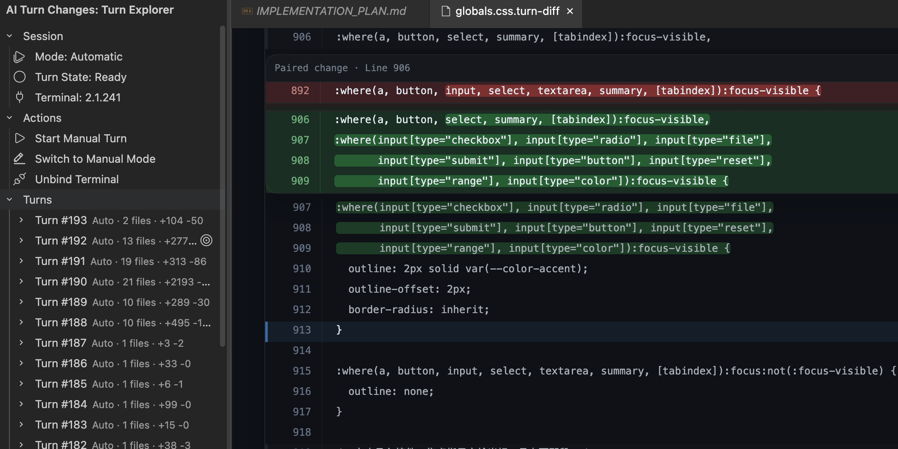

<p align="left">
   <strong>English</strong> | <a href="./README.CN.md">简体中文</a>
</p>

# ai-turn-changes

Track what your terminal AI agent actually changed, turn by turn.

ai-turn-changes is a VS Code extension for inspecting code changes made by terminal-based AI coding agents such as Claude CLI or Codex CLI. Instead of waiting until everything is flattened into a commit, it captures changes as turn-sized units, keeps their history, and renders them with much richer context than a raw diff dump.

If you use terminal agents interactively, this project gives you a missing layer between "the model just changed something" and "I am ready to commit this." Git stays in the loop, but turns become the first-class unit for review.



## Host differences

- Trae supports the full automatic mode. It can combine terminal output, terminal state, and workspace file activity to infer turn boundaries.
- Standard VS Code currently works best in manual mode. The key difference is that published VS Code extensions cannot rely on the same terminal output stream access used by Trae for real-time terminal-state classification.
- In this project, full automatic turn detection depends on reading terminal output so it can classify states like thinking, approval prompts, progress summaries, prompt restoration, and quiet-window fallbacks. Trae can provide that path; standard VS Code does not expose it as a normal stable capability for published extensions.
- This is a host capability difference, not a product logic difference. The current project stance is: full-featured on Trae, stability-first on VS Code.

### VS Code enhanced mode

- If you are a developer and want the full terminal-aware experience in VS Code, you can explicitly enable the proposed terminal API for this extension.
- Add `"enabledApiProposals": ["terminalDataWriteEvent"]` to the extension package if you build your own variant.
- Launch VS Code with the proposed API enabled for this extension:

```bash
code . --enable-proposed-api seanz-hahaha.ai-turn-changes
```

- After that, the extension can attempt the same richer terminal-state detection model used on Trae.
- If the host still does not allow it, the extension falls back gracefully to the stability-first path.

## Why this exists

- `/diff` is good for the current exchange, but it does not give you durable turn history.
- Git diff is commit-oriented, while AI agent workflows are often turn-oriented.
- Reviewing only the changed lines is not enough when you need full-code context to understand what actually happened.
- Git is still used under the hood, but only as the workspace boundary and change-detection layer.

## What it does

When you run an interactive CLI agent, the extension captures the execution as a series of turns and lets you inspect the resulting code changes inside VS Code.

- Manual mode: explicitly start and finish a turn, then inspect the resulting changes.
- Automatic mode: fully available on Trae, where the extension can infer turn boundaries from terminal activity and workspace changes. On standard VS Code, this is not the primary recommended path right now.
- Turn-oriented history: browse earlier turns instead of only the latest one.
- Rich diff reading: open a dedicated turn diff viewer instead of relying on a plain terminal diff dump.

## How it works

- Manual mode: you decide where a turn starts and ends. The extension snapshots the baseline, captures the resulting workspace state, and computes the diff.
- Automatic mode: bind an active terminal, then let the extension observe terminal output, terminal state, and workspace file changes to infer when one AI activity segment has settled. This full path is available on Trae; standard VS Code does not expose the same terminal output capabilities to published extensions.
- File tracking: Git is used to determine the observable file set and respect `.gitignore` rules.
- Snapshot storage: relevant file contents are stored as Snapshots in the extension's local storage. Snapshot lifecycle is managed with reference counting.
- Boundary detection: on Trae, automatic mode can classify terminal states such as thinking, waiting for approval, in-progress summaries, prompt restoration, and fallback quiet windows. On standard VS Code, manual triggering is currently the stable recommendation.

## Usage

- Trae: use automatic mode with `Bind Active Terminal` for the full experience.
- VS Code: use manual mode as the recommended path. Start a turn, let the agent work, finish the turn, then inspect the result.
- VS Code enhanced mode: if you intentionally launch VS Code with `--enable-proposed-api seanz-hahaha.ai-turn-changes`, you can experiment with the fuller automatic mode, but the default recommendation remains manual mode for predictable behavior.

### Sidebar layout

- Session: shows the current mode, turn state, and terminal binding status.
- Actions:
  - Start Turn
  - End Turn
  - Switch Mode
  - Bind Active Terminal
- Turns: shows recorded turns and the files changed in each turn.

## Philosophy

- Git-compatible, but turn-native.
- Commits are for repository history.
- Turns are for understanding what the agent just did.
- The extension does not replace Git. It adds a more useful review layer before commit time.

## Development

1. `npm install`
2. `npm run compile`
3. Press `F5` in VS Code to launch the Extension Development Host

## License

MIT License
